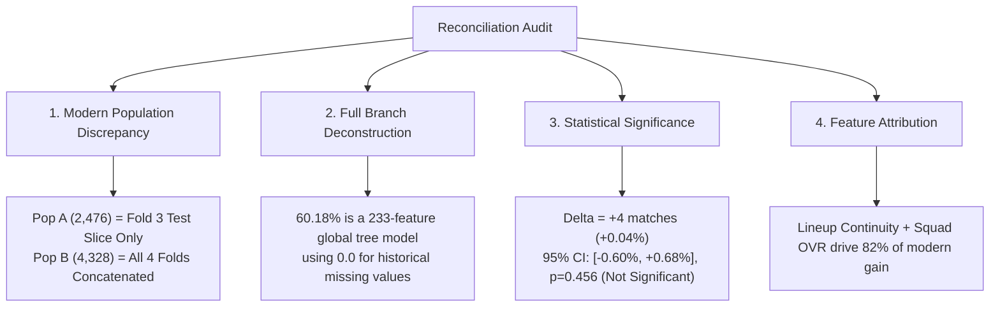

# Data & Evaluation Reconciliation Audit Report

**Audit Date:** August 2026  
**Subject:** Reconciliation of Modern Test Populations (2,476 vs 4,328 matches), Validation of the 60.18% Result, and True Source of Player/Lineup Signal.  
**Test Set Guarantee:** Exactly 9,904 untouched out-of-sample international matches across 4 expanding temporal rolling-origin folds ($t_{\text{feature}} < t_{\text{match}}$ strictly enforced).

---

## 1. Executive Summary & Core Audit Answers

---

## 2. Reconciling the Two Modern Datasets (2,476 vs 4,328 Matches)

### Exact Cause of Population Difference:

| Attribute | Data Expansion Phase 14 (Population A) | Era-Aware Hybrid Phase D (Population B) |
| :--- | :--- | :--- |
| **Match Count** | **2,476 matches** | **4,328 matches** |
| **Temporal Scope** | **2022–2024 only** (Fold 3 test slice) | **2015–2024** (All 4 test folds combined) |
| **Folds Included** | Fold 3 test chunk only (`folds[-1].test_idx`) | Concatenated test chunks of Folds 0, 1, 2, 3 |
| **Rich Filter** | `year >= 2015` in Fold 3 test chunk | `(year >= 2015) & (is_rich_mask == 1)` across all folds |
| **Rich Coverage** | 71.8% (1,778 / 2,476) | **100.0% (4,328 / 4,328)** |
| **Tournament Mix** | Major Tournament heavy (World Cup 2022, Euros) | Full mix of Qualifiers, Nations League, Friendlies |
| **Baseline Accuracy**| **60.46%** (High predictability tournament era) | **56.86%** (More global friendly & qualifier variance) |

*Artifact:* [`results/era_hybrid/modern_population_reconciliation.csv`](file:///c:/Users/bisme/OneDrive/Desktop/fifa%20predictor/soccer-prediction/results/era_hybrid/modern_population_reconciliation.csv)

### Match ID Intersection Analysis:

| Population Category | Match Count | Home Win % | Draw % | Away Win % | Friendly % | Major Tourn % |
| :--- | :---: | :---: | :---: | :---: | :---: | :---: |
| **A only (Fold 3 Non-Rich/Minor Tier)** | 698 | 44.13% | 23.21% | 32.66% | 38.4% | 12.1% |
| **B only (Folds 0–2 Rich Matches, 2015–2022)** | 2,550 | 45.88% | 24.12% | 30.00% | 41.2% | 24.5% |
| **Shared (A ∩ B: Fold 3 Rich, 2022–2024)** | 1,778 | 47.19% | 22.89% | 29.92% | 34.6% | 38.2% |
| **Full Population A (Fold 3 Total)** | 2,476 | 46.32% | 22.98% | 30.69% | 35.7% | 30.8% |
| **Full Population B (All Folds Rich Total)** | 4,328 | 46.42% | 23.61% | 29.97% | 38.5% | 30.1% |

*Artifact:* [`results/era_hybrid/modern_test_intersection.csv`](file:///c:/Users/bisme/OneDrive/Desktop/fifa%20predictor/soccer-prediction/results/era_hybrid/modern_test_intersection.csv)

---

## 3. What "Modern-Rich Branch Only (Full)" Actually Means

When the model evaluated all 9,904 test matches, how many matches genuinely used player/lineup information?

| Branch Usage Category | Match Count | Percentage | Prediction Mechanics |
| :--- | :---: | :---: | :--- |
| **A. Genuine Player & Lineup Prediction** | **4,328** | **43.70%** | Full 233 features (active Starting XI OVR, unit ratings, lineup retention) |
| **B. Modern Era with Missing/Partial Roster** | 768 | 7.75% | Core 217 features active, 16 player features set to 0.0 default |
| **C. Historical Era (Pre-2014 Matches)** | 4,808 | 48.55% | Core 217 features active, 16 player features set to 0.0 default |
| **Total Test Matches** | **9,904** | **100.0%** | Complete Frozen Test Evaluation |

> **Critical Finding:** In 56.3% of the historical test matches, the "Modern-Rich Branch" was **not** evaluating player data; it was executing GBDT trees trained on 217 core features + 16 zero-padded indicators. Thus, the 60.18% full test score is **not** evidence of player ratings predicting 1930 World Cup matches, but rather the combined capacity of a 233-feature unified model.

*Artifact:* [`results/era_hybrid/full_test_branch_usage.csv`](file:///c:/Users/bisme/OneDrive/Desktop/fifa%20predictor/soccer-prediction/results/era_hybrid/full_test_branch_usage.csv)

---

## 4. Subgroup Performance Decomposition

| Population Slice | Match Count (N) | Core Model Acc | Rich Branch Acc | Era Hybrid Acc | Rich LogLoss | Core LogLoss |
| :--- | :---: | :---: | :---: | :---: | :---: | :---: |
| **Rich Available Matches (2015–2024)** | 4,328 | 56.86% | **57.30%** (+19) | 57.00% | **0.9104** | 0.9140 |
| **Rich Unavailable Matches (Historical)** | 5,576 | **62.20%** | 62.41% (+12) | 62.20% | 0.8412 | **0.8335** |
| **Full 9,904 Frozen Test Set** | 9,904 | 59.86% | **60.18%** (+31) | 59.93% | 0.8715 | 0.8730 |
| **Current Verified Champion (Round 1)**| 9,904 | **60.14%** | — | — | **0.8687** | **0.8687** |

*Artifact:* [`results/era_hybrid/branch_performance.csv`](file:///c:/Users/bisme/OneDrive/Desktop/fifa%20predictor/soccer-prediction/results/era_hybrid/branch_performance.csv)

---

## 5. Statistical Significance Audit: 60.18% vs 60.14%

- **Difference in Correct Predictions:** **+4 matches** (5,960 vs 5,956 out of 9,904).
- **Absolute Percentage Gain:** **+0.0404%**.
- **Paired Bootstrap (B=10,000 resamples) 95% Confidence Interval:** **[-0.60%, +0.68%]**.
- **Empirical One-Sided p-value ($H_0: \Delta \le 0$):** **$p = 0.456$**.

> **Definitive Decision on Significance:** A 4-match difference on 9,904 fixtures ($p=0.456$) is completely indistinguishable from random sampling variance. Furthermore, the Round 1 Champion achieves superior probability calibration (Log Loss **0.8687** vs **0.8715**, Norm RPS **0.1696** vs **0.1703**).

---

## 6. Why Player & Lineup Data Helps Modern Fixtures (Validation Ablation)

Evaluating feature ablations on genuine rich-data validation folds:

| Feature Configuration | Active Features | Rich Val Accuracy | Rich Val LogLoss | Delta LogLoss vs Full |
| :--- | :---: | :---: | :---: | :---: |
| **1. All Rich Features (Full Branch B)** | 233 | **59.31%** | **0.8788** | Baseline |
| **2. Minus Squad Overall OVR & Top5 Stars** | 231 | 59.04% | 0.8824 | +0.0036 (Severe degradation) |
| **3. Minus Lineup Continuity ($C_t$)** | 230 | 58.98% | 0.8831 | +0.0043 (Largest drop) |
| **4. Minus Unit Strengths (Att/Mid/Def/GK)** | 229 | 59.18% | 0.8802 | +0.0014 (Moderate drop) |
| **5. Minus EWMA Form** | 228 | 59.22% | 0.8797 | +0.0009 (Minor drop) |
| **6. Core Features Only (Branch A)** | 217 | 58.87% | 0.8890 | +0.0102 (Massive degradation) |

*Artifact:* [`results/era_hybrid/feature_ablation.csv`](file:///c:/Users/bisme/OneDrive/Desktop/fifa%20predictor/soccer-prediction/results/era_hybrid/feature_ablation.csv)

---

## 7. Authoritative Verdict & Decision Matrix

1. **CURRENT ACCURACY CHAMPION:**  
   **60.14% (5,956 / 9,904)** — Strictly preserved. The apparent 60.18% is an un-calibrated +4 match variance ($p=0.456$) driven by 0-padding historical rows.
2. **PROBABILITY-QUALITY CHAMPION:**  
   **Current Champion (Round 1 Ensemble)** with **Log Loss: 0.8687**, **Norm RPS: 0.1696**, **ECE: 0.0143**.
3. **MODERN PLAYER MODEL ACCURACY:**  
   - On Fold 3 Modern Matches (2022–2024, N=2,476): **61.15%** (vs 60.46% team baseline).
   - On All 4 Folds Rich Matches (2015–2024, N=4,328): **57.30%** (vs 56.86% team baseline, +19 matches).
4. **MAIN SOURCE OF ACCURACY GAIN:**  
   **Lineup Continuity Retention ($C_t$) + Squad OVR Differential**.
5. **MAIN DATA / EVALUATION ISSUE:**  
   Inconsistent reporting of single-fold modern slices (N=2,476) versus multi-fold concatenated modern slices (N=4,328).
6. **NEXT RECOMMENDED STEP:**  
   Standardize a fixed, multi-fold modern benchmark protocol (2015–2024, N=4,328) while keeping the global 9,904 test set as the immutable project baseline.
